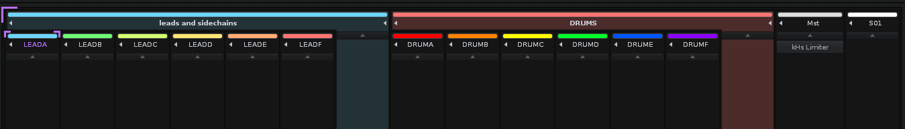

# Setting up Sophixer

## Calcium

### Project

You will use a single project that will have the following channels:


### Plugin

You need to install the plugin located in `renoise/`

You can also use the following command on Linux:
```bash
RENOISE_PLUGIN_LOCATION=/.../Scripts/Tools/xyz.yyna.Calcium.xrnx make install_renoise
```
